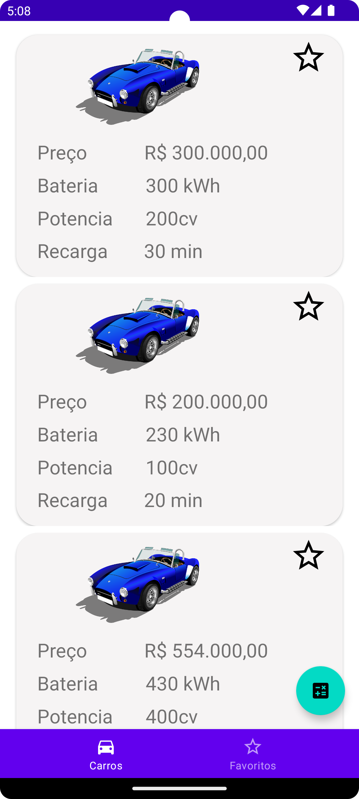
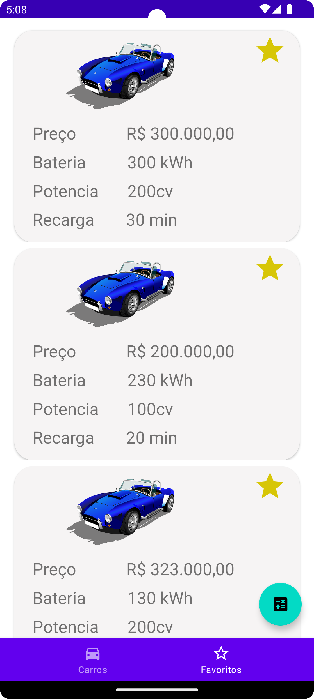

# EletriCarApp_DIO.ME

# Documentação do App

## Visão geral

Esta é a documentação oficial do aplicativo [Eletric Car], um aplicativo [sobre carros eletricos e calculos de autônomia de carros].

## Screenshots
      

## Tecnologias utilizadas

O aplicativo foi desenvolvido utilizando as seguintes tecnologias:

- Android Studio
- Kotlin
- [Retrofit](https://square.github.io/retrofit/)
- [Navigation Controller](https://developer.android.com/guide/navigation/navigation-principles?hl=pt-br)
- Consumo de API JSON
- [GitHub Pages](https://pages.github.com)

## Instalação

Para instalar o aplicativo, siga os seguintes passos:

1. Clone o Repositorio na maquina [aqui](https://github.com/JorgeTranin/EletriCarApp_DIO.ME.git).
2. Abra o Android Studio e execute o app

## Como usar

Para utilizar o aplicativo, siga os seguintes passos:

1. Abra o aplicativo.
2. Simule qual carro quer calcular a autonomia
3. Adicione carros a sua coleção favoritos
4. Calcule autonomia de cada carro eletrico

## Contribuição

Quem quiser fazer contribuições para o aplicativo! basta fazer as mudanças e criar um pull Requests

1. Faça um fork deste repositório.
2. Crie uma branch com sua nova funcionalidade: `git checkout -b my-new-feature`
3. Faça suas alterações e faça commit: `git commit -m 'Add some feature'`
4. Envie suas alterações para a branch principal: `git push origin my-new-feature`
5. Abra um Pull Request e descreva suas alterações.

## Autoria e Licença

Este aplicativo foi desenvolvido por [Jorge Tranin] e é licenciado sob [MIT].
